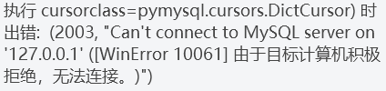
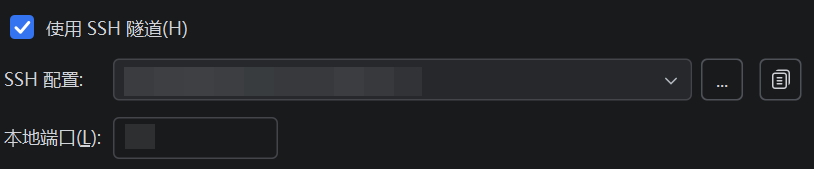

# 影刀 RPA 与 MySQL 连接排错：`Can't connect to MySQL server on 127.0.0.1`

> 记录一次在使用影刀 RPA 向学校服务器上的 MySQL 批量写入数据时的排错过程，  
> 并系统梳理 `127.0.0.1:3306`、端口监听、SSH Tunnel 等核心概念。

---

## 一、背景说明
项目需求本身并不复杂：
- 使用 **影刀 RPA** 自动抓取网页数据  
- 将数**据批量插入**到 **学校服务器上的 MySQL**
- 使用 **DataGrip** 对数据进行后续清洗、分析和处理  

但在实际执行时，影刀在数据库写入阶段始终报错：
```text
Can't connect to MySQL server on '127.0.0.1'
```
一开始我以为是用户名/密码错误，在尝试几次无果后，寻求GPT的帮助。最后，定位到是影刀与MySQL连接问题，经过几个步骤后成功解决影刀连接学校服务器MySQL的问题。

**问题本质：对host的理解不对，导致填写的127.0.0.1无法连接到目的地MySQL**

<figure align="center">
  
  <figcaption>
    <em>图 1：MySQL 连接失败时的关键报错信息</em>
  </figcaption>
</figure>

## 二、解决过程
#### 2.1 关键认知1
> `127.0.0.1` 只代表“当前这台机器自己

| 场景 | 127.0.0.1指代 |
|:---:|:---:|
| 在自己电脑上 | 自己电脑 | 
| 在服务器上 | 服务器自己 |
| 在影刀运行环境里 | 影刀所在机器 |

**所以最初为什么一定会连接失败？**
- MySQL实际上在**服务器上**
- 影刀在**我的本机**
- 让影刀去连`127.0.0.1` = 连接本机的MySQL
  
但我的本机没有安装MySQL，必然是Connection refused。

#### 2.2 关键认知2
> 为什么 Datagrip 能连，但影刀不行？
>>我发现我的Datagrip能连接MySQL，且其 Host 显示的是`127.0.0.1`

Datagrip 并不是直连MySQL的，我勾选了：
> Use SSH tunnel / SSH tunnel
> 且分配了本地端口

<figure align="center">
  
  <figcaption>
    <em>图 2：Datagrip SSH设置</em>
  </figcaption>
</figure>

Datagrip 实际做的是：
```text
你的电脑
  |
  |  SSH
  v
服务器
  |
  |  本地 TCP
  v
MySQL (127.0.0.1:3306)
```
DataGrip 在启用 SSH Tunnel 后，会在本机创建一个临时监听端口，并通过 SSH 将该端口转发至服务器本地的 MySQL 端口（127.0.0.1:3306）。本机访问该临时监听端口，等价于在服务器本地访问 MySQL。这实际上是一次典型的 SSH 本地端口转发（local port forwarding）。

#### 2.3 关键认知3
> SSH Tunnel 是什么？

**SSH 隧道 = 把服务器的一个“本地端口”，映射成你电脑的一个“本地端口”**
使用这条命令：
```bash
ssh -N -L 13306:127.0.0.1:3306 your_ssh_user@your_server_ip
```
本质含义是：
**把服务器的`127.0.0.1:3306`（MySQL)**
**映射成我电脑的`127.0.0.1:13306`**
于是电脑上出现了一个“假MySQL”
`127.0.0.1:13306` --> 通向服务器的 MySQL

#### 2.4 根本原因总结
Datagrip 通过设置能够自己建设 SSH 通道，进行 SSH 本地端口转发。但影刀不会。所以，我们需要为影刀开一个 SSH 隧道，让影刀能够顺利访问服务器上的 MySQL。

---

#### 2.5 解决方法
在 `PowerShell/CMD`上新建 SSH 隧道：
```bash
ssh -N -L 13306:127.0.0.1:3306 your_ssh_user@your_server_ip
```
- `13306`：本机端口（可改）
- `3306`：服务器 MySQL 端口（默认3306)
- `-N`：不进入远端 shell，只做转发

这个窗口保持开放，在影刀中填写连接参数：
- **Host**:`127.0.0.1`
- **Port**:`13306`
- **username/password**: MySQL 的账户名
- **database_name**: 需要使用的库名
真实链路和 Datagrip 一样：
```text
影刀
 ↓
127.0.0.1:13306 （本机端口）
 ↓
SSH 隧道
 ↓
服务器 127.0.0.1:3306
 ↓
MySQL
```
当结束影刀操作，需要断开与服务器 MySQL 时，关闭`PowerShell/CMD`即可。

## 三、总结
通过这次排错，深入理解了 SSH Tunnel的使用方法，日后如果碰到类似的数据库连接问题，可以按照这个思路安全、快捷的解决。在实际使用中，还可改进的地方在于：
- 可以通过SSH 客户端工具（如 MobaXterm，Xshell）图形化配置本地端口转发，实现登录即自动建立隧道。
- 引入 KeepAlive 或 autossh 提升隧道稳定性，避免因网络抖动导致连接中断；
- 为自动化程序单独创建最小权限的数据库账号，明确工具职责边界；
- 以及对本地映射端口进行规范化管理，提升可维护性和可复用性。

这些改进并不会改变方案 B 的基本原理，而是让其从短期解决方案升级为长期可用、稳定且工程化的方案。


