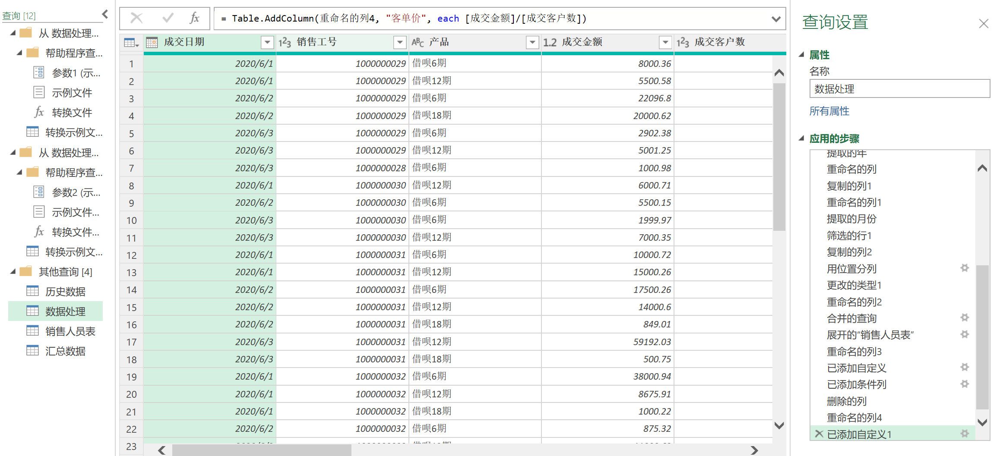
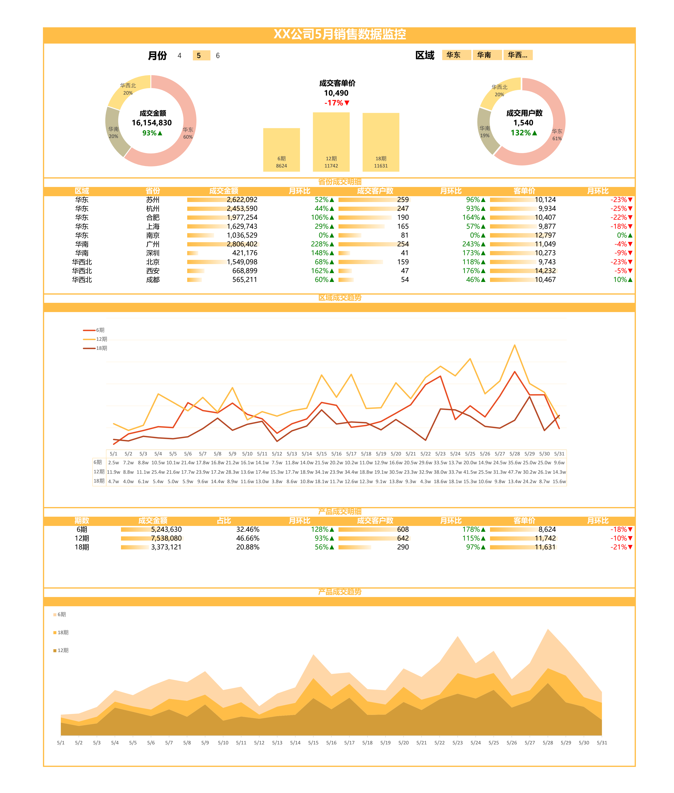

---
## 一、项目背景

在前一项目中，我基于销售成交数据构建了一套 Excel 数据分析报表，实现了基本的销售指标统计与分析。

原始项目：[项目文章链接](https://reallx.github.io/projects/01_excelanalysis/)

随着业务数据不断增加，原始报表在数据更新效率与分析展示方面逐渐显现出一定局限。因此，在本项目中对报表系统进行了进一步优化与完善。

---

## 二、项目目标

本次优化的主要目标包括：

- 提升销售数据处理效率  
- 实现销售数据自动化更新  
- 构建更加完整的销售分析看板  
- 提高数据分析结果的可视化表达能力  

---

## 三、优化内容

#### 1. 使用 Power Query 实现自动化数据处理

为了减少手动整理数据的工作量，使用 Power Query 构建数据处理流程。

具体实现方式如下：

- 建立销售数据处理文件夹  
- 每月将新的销售数据文件放入该文件夹  
- Power Query 自动读取文件夹中的所有销售数据文件  
- 自动完成数据清洗与字段结构统一  
- 自动更新销售数据总表  

通过该方法，实现了销售数据的自动汇总与更新，显著降低了人工整理数据的时间成本。

---

### （二）构建销售数据分析看板（Dashboard）

在数据处理自动化的基础上，使用数据透视表（Pivot Table）构建销售分析看板。

看板主要包括以下分析内容：

- 月度销售金额趋势分析  
- 不同区域销售贡献分析  
- 产品销售结构分析   

通过图表与数据透视表的结合，使销售数据能够以更加直观的方式呈现，并帮助管理者快速获取关键经营信息。

---

## 四、项目成果展示

完整报表下载：

[Project GitHub URL](https://github.com/Reallx/EXCEL_Sales_Dashboard/tree/main)

💡 项目亮点
- 使用 Power Query 实现销售数据自动化更新  
- 构建可复用的数据处理流程  
- 使用数据透视表构建可视化销售分析看板  
- 提升数据更新效率与数据分析能力  

🛠 技术栈
- Power Query  
- Pivot Table  
- Dashboard Design  
- Data Analysis

