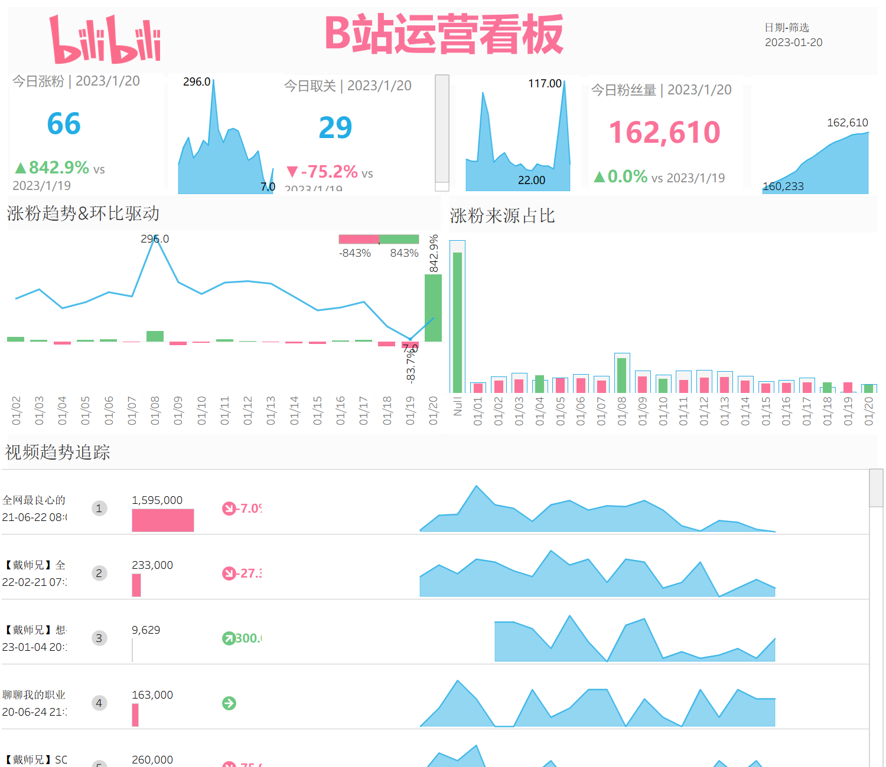

## 一、项目背景

在内容运营场景中，账号数据更新频率高、指标变化快，如果只依赖人工登录后台查看数据，不仅效率较低，也很难形成连续的数据观察视角。

因此，我尝试搭建一套轻量的数据分析流程：通过影刀 RPA 从 B 站数据中心定时抓取账号核心数据，存入 MySQL 数据库，再使用 Tableau 制作可视化 Dashboard，用于监控账号增长情况与视频带来的关注变化。

---

## 二、项目目标

本项目主要解决以下几个问题：

- 自动获取 B 站账号运营数据，减少重复性人工操作
- 建立结构化的数据表，便于后续查询与分析
- 搭建可视化看板，快速查看账号核心 KPI
- 通过趋势图观察视频内容对粉丝增长的影响

---

## 三、项目实现流程

整个项目流程如下：

1. 使用影刀 RPA 登录并进入 B 站数据中心  
2. 抓取账号相关核心数据，并进行初步整理  
3. 将数据写入 MySQL 数据库，形成可持续更新的数据源  
4. 在 Tableau 中连接 MySQL 数据库，搭建可视化 Dashboard  
5. 通过 KPI 卡片与趋势图展示账号运营表现  

这套流程将“数据采集 - 数据存储 - 数据展示”串联起来，使原本分散在平台后台的数据可以沉淀为持续积累的分析资产。

---

## 四、Dashboard 展示内容

### 1. 核心 KPI 指标

看板重点展示以下核心指标：

- 当日涨粉
- 当日取关
- 当前粉丝量

这部分内容可以帮助快速判断账号在短周期内的增长表现，尤其适合用于日常复盘与异常波动监控。

### 2. 视频关注趋势

除了静态指标，我还在 Tableau 中展示了视频关注趋势，用于观察不同视频发布后对账号关注增长的带动效果。

相比只看单日粉丝变化，视频关注趋势更能反映内容表现与用户反馈之间的关系，也更适合支持后续的内容选题复盘。

### 3. Dashboard

---

## 五、项目亮点

- 使用 RPA 自动采集平台数据，提升数据获取效率
- 通过 MySQL 对数据进行集中存储，方便后续扩展分析
- 使用 Tableau 将账号运营数据可视化，提升信息读取效率
- 将账号级指标与视频级趋势结合，兼顾整体监控与内容分析

---

## 六、项目总结
**项目流程：**
   数据准备：utf-8 的.csv 格式文件（Excel 另存为的 utf-8 为 utf-8 BOM 需要在记事本中重新另存为）整合表格，提取关键信息，建立一张大表以制作dashboard，但要注意粒度问题，避免笛卡尔积。

   数据链接：修改链接模式为数据提取

   数据整理：修正数据类型、聚合依据、区分维度和度量、做好数据分类

   制作看板

在这个项目中，我最大的感受是：**运营数据真正有价值的地方，不只是“看到结果”，而是“持续观察变化”。**

单独查看某一天的涨粉或取关，只能反映局部表现；但当这些数据被持续记录下来，并结合视频维度做趋势分析后，才更容易识别哪些内容在稳定带来增长，哪些波动只是短期现象。

项目的不足之处在于：看板美化还可以做的更好。下半部分的视频趋势变化属于静态观察，只基于当前数据进行排名总结，日后维护与更新比较麻烦。

#### 技术栈及遇到的问题

- 影刀 RPA
- MySQL
- Tableau
- Dashboard Design
- Data Analysis
---

1.**问题**：账号数据和视频数据放在一张表格时，直接在 Tableau 中使用账号数据会出现笛卡尔积

**问题原因：**（以新增关注为例）“新增关注"本来是账号级的指标只有一条，但在以日期链接视频数据表和账号数据表时，会把账号数据复制到每一个视频数据上。聚合表的真实粒度为：日期下有多条视频记录，每条视频记录带着同一个涨粉值。
总结来说就是不同粒度的表格链接产生的问题，账号的“日期级指标”和视频的“视频+日期”这个更细粒度的表链接时，Tableau 会把同一天的值按视频行数进行重复累计。

**解决方案：**
   1）使用平均作为聚合依据❌
      日粒度下平均值刚好能抵消重复；但在周粒度下，会把这周所有视频条目下的“新增关注”求平均。我们希望的是每天只有一条“新增关注”，然后求平均

   2）使用 LOD 进行修正✅
      `账号每日新增关注-修正：sum({FIXED 数据所属日期 :AVG(账号每日新增关注)})`
      FIXED：无论你视图里放了什么字段，都固定按指定的维度来计算。
      sum()：按照周/月汇总时，把每一天的新增关注加起来

2.**问题**：按快捷键 CTRL + Shift + B 工作表无放大反应

**问题原因**：视图锁定成整个视图

**解决方案**：更改成标准，再使用快捷键即可对工作表进行放大

